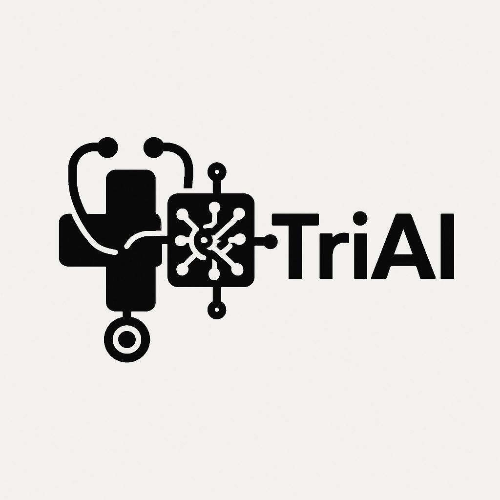
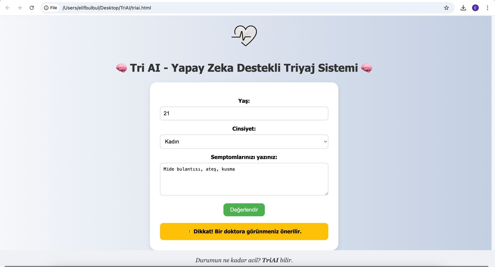
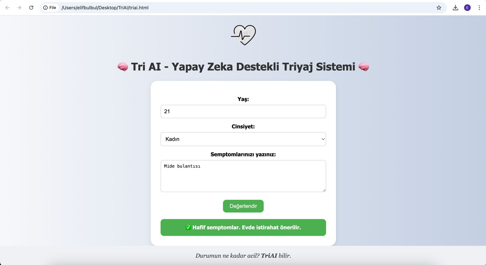
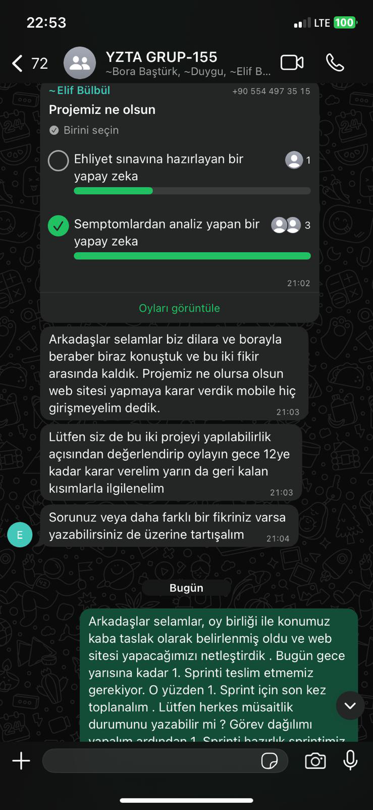
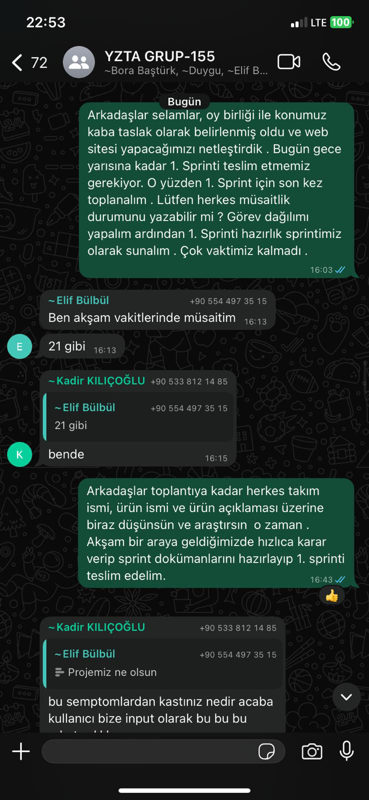
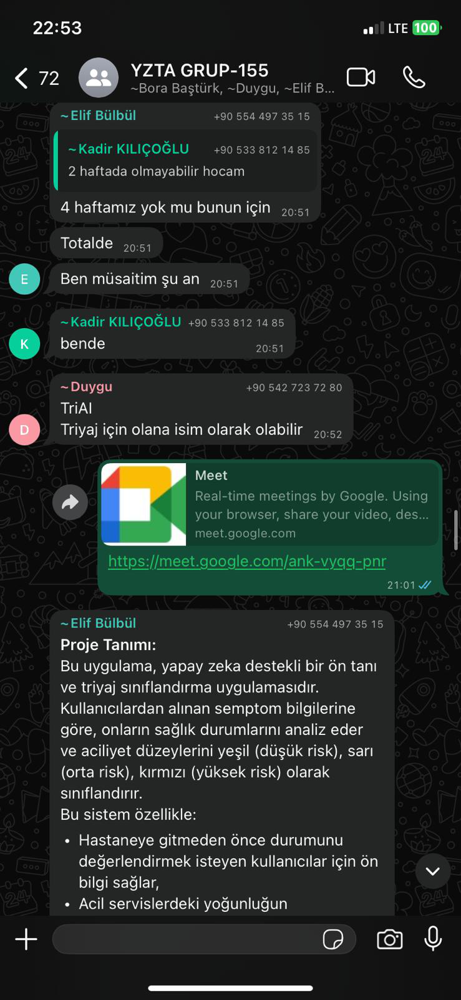
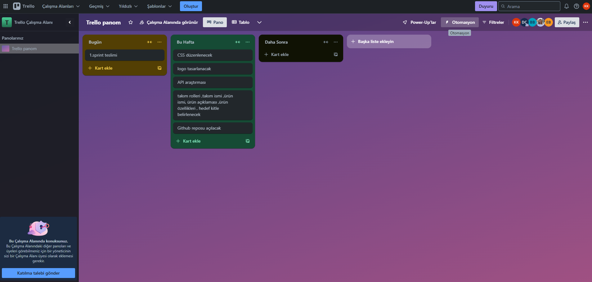

# Takım Adı: Sempteams

**Takım Üyeleri**

Dilara ÇAKIR * Scrum Master  www.linkedin.com/in/dilara-çakır-55312a270

Abdulkadir KILIÇOĞLU * Product Owner  www.linkedin.com/in/abdulkadirkilicoglu

Elif BÜLBÜL * Developer  https://www.linkedin.com/in/elif-bulbul/

Duygu YILMAZ * Developer  www.linkedin.com/in/duygu-irem-yilmaz-599b25258

Bora BAŞTÜRK * Developer  www.linkedin.com/in/borabasturk

# Ürün Adı: TriAI
 

## Ürün Açıklaması: TriAI

Bu uygulama, yapay zeka destekli bir ön tanı ve triyaj sınıflandırma uygulamasıdır... 
Kullanıcılardan alınan semptom bilgilerine göre, onların sağlık durumlarını analiz eder ve aciliyet düzeylerini yeşil (düşük risk), sarı (orta risk), kırmızı (yüksek risk) olarak sınıflandırır.
Bu sistem özellikle:
- Hastaneye gitmeden önce durumunu değerlendirmek isteyen kullanıcılar için ön bilgi sağlar,
- Acil servislerdeki yoğunluğun azaltılmasına yardımcı olur,
- Kırsal bölgelerde yaşayan veya sağlık hizmetine hızlı erişimi olmayan bireyler için rehberlik sunar.

**Ürün Özellikleri**

- Semptom Analizi: Kullanıcının serbest metinle yazdığı semptomları analiz eder.
- Yapay Zeka Yorumlama: Gemini modeli ile semptomları bağlama göre değerlendirir.
- Triyaj Raporu: Renk kodlu sonuç kartı sunar (yeşil, sarı, kırmızı).
- Bilgilendirici Tavsiye: Kullanıcıya, belirtilen duruma uygun öneri verir.
- Web Tabanlı Arayüz: Tüm cihazlardan erişilebilen sade ve hızlı bir web uygulaması.
- Geçmiş Sorgular: Kullanıcı önceki sorgularını görebilir.

**Hedef Kitle**

*Bireysel kullanıcılar (özellikle sağlık bilinci düşük olanlar):*
Sağlıkla ilgili karar alma süreçlerinde zorlanan bireyler için rehber niteliğinde bir ön değerlendirme sunar.

*Sağlık hizmetine anlık erişimi olmayan bireyler:*
Hastaneye ulaşımı kısıtlı olan kişiler için ilk adım sağlık kontrolü sağlar.

*Kırsal bölgede yaşayanlar:*
Uzak bölgelerde yaşayan kullanıcıların sağlık durumlarını önceden değerlendirebilmelerine yardımcı olur.

*Yaşlı bireyler veya bakım hizmeti veren kişiler:*
Yaşlı bireylerin aciliyetini kolayca anlayabilmeleri ve bakıcıların doğru zamanda müdahale edebilmesi için destek sağlar.

*Sağlık teknolojilerine ilgi duyan genel kullanıcılar:*
Yapay zekâ destekli dijital sağlık çözümlerini deneyimlemek isteyen kullanıcılar için modern bir arayüz sunar.

    
<h1>Sprint 1</h1>

    
<h3>Sprint 1 - App Screenshots</h3>

  <table style="width: 100%;">
    <tr>
      <td colspan="4" style="text-align: center;"><h2> Ana Ekran Sayfaları</h2></td>
    </tr>
    <tr>
      <td style="width: 25%;"></td>
      <td style="width: 25%;"></td>
    </tr>
  </table>
  
   

  

    
<h3>Sprint 1 - Sprint Board Update Screenshots</h3>

    
    
    
  

  

    
<h3>Sprint 1 - Proje Takip Aracı</h3>

    
  

  - **Sprint Notes**:
    "İlk sprint sürecinde görev dağılımı yapıldı. Herkesten kod yazması istenmesi üzerine görevlerde ortak payda sağlanarak herkesin olağan uygunluk durumuna göre yapabilirlik seviyesine göre görevlerde rol alması sağlandı.
İlk olarak tasarımın canvada yapılmasına karar verildi."

  - **Sprint içinde beklenen puan tamamlama**: 13 puan
  - **Puan Tamamlama Mantığı**: "
| Ürün fikrinin ve vizyonunun netleştirilmesi | 3 SP | Araştırma ve ekip içi tartışmalar |
| Teknolojik altyapının belirlenmesi | 2 SP | LLM, frontend ve backend seçimleri |
| Semptom analiz akışının planlanması | 3 SP | Kullanıcıdan veri alma ve işleme |
| Gemini LLM kullanım araştırması | 3 SP | API + NLP senaryoları |
| UI mockup taslağı oluşturulması | 2 SP | Giriş ve sonuç ekranlarının temel taslağı |
  
  "
  - **Daily Scrum**: "
    
    •⁠  ⁠Platform: Google Meet  
    •⁠  ⁠Sıklık: Haftalık toplantılar  
    •⁠  ⁠İçerik:  
      - Kim ne yapıyor?  
      - Karşılaşılan engeller  
      - Sapmalar var mı?  
    •⁠  ⁠Notlar: WhatsApp üzerinden saklanmaktadır
  "
  - **Product Backlog URL:** 
  https://trello.com/b/ZeRCIMNF/trello-panom
  - **Sprint Review:**
    "
    *Tamamlananlar:*
- Ürün fikri netleştirildi  
- Teknolojik yapı belirlendi  
- Semptom analiz mimarisi tanımlandı  
- Gemini LLM örnek istekleri araştırıldı  

*Eksik Kalanlar:*
- UI bileşenleri sadece taslak seviyesinde
    "

  - **Sprint Review Participants:** Dilara ÇAKIR, Abdulkadir KILIÇOĞLU, Elif BÜLBÜL, Duygu YILMAZ, Bora BAŞTÜRK 
  - **Sprint Retrospective:**
    "
  İyi Gidenler:
  •⁠  ⁠Takım içi iletişim akıcıydı  
  •⁠  ⁠Hızlı fikir birliği sağlandı  
  •⁠  ⁠Görev dağılımı net yapıldı

  Geliştirilmesi Gerekenler:
  •⁠  ⁠Daily scrum saatleri düzenli ve daha sık olmalı  
  •⁠  ⁠Dokümantasyon zamanında GitHub’a aktarılmalı
    "

  

  

