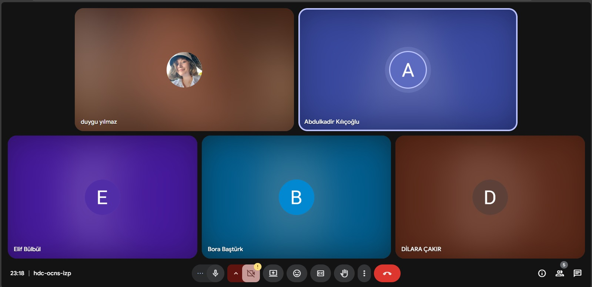
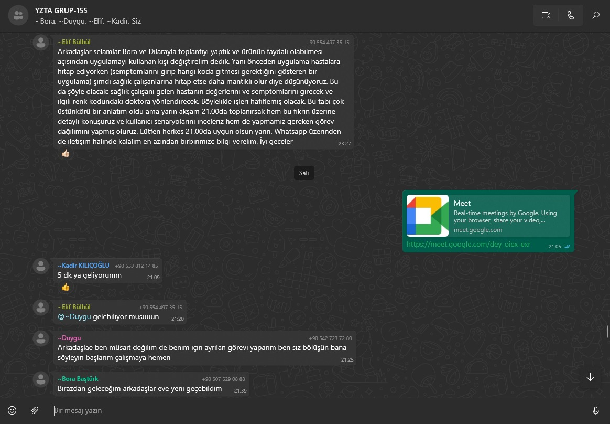

# Takım Adı: Sempteams

**Takım Üyeleri**

Dilara ÇAKIR * Scrum Master  www.linkedin.com/in/dilara-çakır-55312a270

Abdulkadir KILIÇOĞLU * Product Owner  www.linkedin.com/in/abdulkadirkilicoglu

Elif BÜLBÜL * Developer  https://www.linkedin.com/in/elif-bulbul/

Duygu İrem YILMAZ * Developer  www.linkedin.com/in/duygu-irem-yilmaz-599b25258

Bora BAŞTÜRK * Developer  www.linkedin.com/in/borabasturk

# Ürün Adı: TriAI
 

## Ürün Açıklaması: TriAI

Bu uygulama, yapay zeka destekli bir ön tanı ve triyaj sınıflandırma uygulamasıdır... 
Kullanıcılardan alınan semptom bilgilerine göre, onların sağlık durumlarını analiz eder ve aciliyet düzeylerini yeşil (düşük risk), sarı (orta risk), kırmızı (yüksek risk) olarak sınıflandırır.
Bu sistem özellikle:
- Hastaneye gitmeden önce durumunu değerlendirmek isteyen kullanıcılar için ön bilgi sağlar,
- Acil servislerdeki yoğunluğun azaltılmasına yardımcı olur,
- Kırsal bölgelerde yaşayan veya sağlık hizmetine hızlı erişimi olmayan bireyler için rehberlik sunar.

**Ürün Özellikleri**

- Semptom Analizi: Kullanıcının serbest metinle yazdığı semptomları analiz eder.
- Yapay Zeka Yorumlama: Gemini modeli ile semptomları bağlama göre değerlendirir.
- Triyaj Raporu: Renk kodlu sonuç kartı sunar (yeşil, sarı, kırmızı).
- Bilgilendirici Tavsiye: Kullanıcıya, belirtilen duruma uygun öneri verir.
- Web Tabanlı Arayüz: Tüm cihazlardan erişilebilen sade ve hızlı bir web uygulaması.
- Geçmiş Sorgular: Kullanıcı önceki sorgularını görebilir.

**Hedef Kitle**

*Bireysel kullanıcılar (özellikle sağlık bilinci düşük olanlar):*
Sağlıkla ilgili karar alma süreçlerinde zorlanan bireyler için rehber niteliğinde bir ön değerlendirme sunar.

*Sağlık hizmetine anlık erişimi olmayan bireyler:*
Hastaneye ulaşımı kısıtlı olan kişiler için ilk adım sağlık kontrolü sağlar.

*Kırsal bölgede yaşayanlar:*
Uzak bölgelerde yaşayan kullanıcıların sağlık durumlarını önceden değerlendirebilmelerine yardımcı olur.

*Yaşlı bireyler veya bakım hizmeti veren kişiler:*
Yaşlı bireylerin aciliyetini kolayca anlayabilmeleri ve bakıcıların doğru zamanda müdahale edebilmesi için destek sağlar.

*Sağlık teknolojilerine ilgi duyan genel kullanıcılar:*
Yapay zekâ destekli dijital sağlık çözümlerini deneyimlemek isteyen kullanıcılar için modern bir arayüz sunar.

    
<h1>Sprint 1</h1>

    
<h3>Sprint 1 - App Screenshots</h3>

  <table style="width: 100%;">
    <tr>
      <td colspan="4" style="text-align: center;"><h2> Ana Ekran Sayfaları</h2></td>
    </tr>
    <tr>
      <td style="width: 25%;"></td>
      <td style="width: 25%;"></td>
    </tr>
  </table>
  
   

  

    
<h3>Sprint 1 - Sprint Board Update Screenshots</h3>

    
    
    
    
  

  

    
<h3>Sprint 1 - Proje Takip Aracı</h3>

    
  

  - **Sprint Notes**:
    "İlk sprint sürecinde görev dağılımı yapıldı. Herkesten kod yazması istenmesi üzerine görevlerde ortak payda sağlanarak herkesin olağan uygunluk durumuna göre yapabilirlik seviyesine göre görevlerde rol alması sağlandı.
İlk olarak tasarımın canvada yapılmasına karar verildi."

  - **Sprint içinde beklenen puan tamamlama**: 13 puan
  - **Puan Tamamlama Mantığı**: "
| Ürün fikrinin ve vizyonunun netleştirilmesi | 3 SP | Araştırma ve ekip içi tartışmalar |
| Teknolojik altyapının belirlenmesi | 2 SP | LLM, frontend ve backend seçimleri |
| Semptom analiz akışının planlanması | 3 SP | Kullanıcıdan veri alma ve işleme |
| Gemini LLM kullanım araştırması | 3 SP | API + NLP senaryoları |
| UI mockup taslağı oluşturulması | 2 SP | Giriş ve sonuç ekranlarının temel taslağı |
  
  "
  - **Daily Scrum**: "
    
    •⁠  ⁠Platform: Google Meet  
    •⁠  ⁠Sıklık: Haftalık toplantılar  
    •⁠  ⁠İçerik:  
      - Kim ne yapıyor?  
      - Karşılaşılan engeller  
      - Sapmalar var mı?  
    •⁠  ⁠Notlar: WhatsApp üzerinden saklanmaktadır
  "
  - **Product Backlog URL:** 
  https://trello.com/b/ZeRCIMNF/trello-panom
  - **Sprint Review:**
    
    *Tamamlananlar:*
- Ürün fikri netleştirildi  
- Teknolojik yapı belirlendi  
- Semptom analiz mimarisi tanımlandı  
- Gemini LLM örnek istekleri araştırıldı  

*Eksik Kalanlar:*
- UI bileşenleri sadece taslak seviyesinde
    "

  - **Sprint Review Participants:** Dilara ÇAKIR, Abdulkadir KILIÇOĞLU, Elif BÜLBÜL, Duygu YILMAZ, Bora BAŞTÜRK 

# Sprint 1 - Retrospective 

## İyi Gidenler

- **Takım İçi İletişim Güçlüydü:**  
  Ekip üyeleri fikirlerini açıkça ifade edebildi ve karar alma süreçlerinde herkesin katkısı oldu. Bu durum fikir birliğine hızlı bir şekilde ulaşılmasını sağladı.

- **Görev Dağılımı Verimliydi:**  
  Görevler, ekip üyelerinin teknik yeterliliklerine ve uygunluk durumlarına göre dengeli şekilde dağıtıldı. Herkesin kodlama sürecine katkı sağlaması teşvik edildi ve büyük ölçüde başarıldı.

- **Sprint Hedeflerine Odaklanıldı:**  
  Ürün fikri, teknolojik yapı ve semptom analiz mimarisi gibi temel sprint hedefleri başarıyla tamamlandı. Önceden belirlenen story point’lerin çoğu yerine getirildi.

---

##  Geliştirilmesi Gerekenler

- **Daily Scrum Toplantı Frekansı Yetersizdi:**  
  Haftada yalnızca bir kez yapılan toplantılar, bazı sorunların geç fark edilmesine yol açtı. Daha sık toplantılar ile süreç daha kontrollü ilerleyebilirdi.

- **Dokümantasyon Eksikliği:**  
  WhatsApp üzerinden yapılan birçok teknik tartışma ve karar, GitHub veya ortak bir dokümantasyon alanına aktarılmadı. Bu durum bilgi kaybına ve takibin zorlaşmasına neden oldu.

- **UI Mockup Yetersiz Kaldı:**  
  Canva üzerinden sadece giriş ve sonuç ekranları tasarlandı. Kullanıcı deneyimi açısından daha fazla ekran taslağına ihtiyaç duyulmakta.

---

##  Aksiyon Adımları (Bir Sonraki Sprint İçin)

- **Daily Scrum Toplantıları Artırılacak:**  
  Haftada en az 2 kez kısa Google Meet toplantıları yapılacak. Bu toplantılarda görev durumu, engeller ve sapmalar değerlendirilecek.

- **GitHub Üzerinden Düzenli Dokümantasyon:**  
  Her ekip üyesi kendi sorumlu olduğu işi (kod, araştırma çıktısı, mimari çizimler vb.) haftalık olarak GitHub’a yükleyecek. Bu süreç Trello üzerinden kontrol edilecek.

- **UI Mockup Genişletilecek:**  
  Sadece giriş ve sonuç ekranları ile sınırlı kalmayacak şekilde; semptom girişi, analiz sonucu ve kullanıcı profili ekranları da tasarlanacak. Taslaklar Canva veya Figma üzerinden hazırlanacak ve GitHub’a yüklenecek.

  

    
<h1>Sprint 2</h1>

    
<h3>Sprint 2 - App Screenshots</h3>

  <table style="width: 100%;">
    <tr>
      <td colspan="4" style="text-align: center;"><h2> Ana Ekran Sayfaları</h2></td>
    </tr>
    <tr>
      <td style="width: 25%;"></td>
      <td style="width: 25%;"></td>
      <td style="width: 25%;"></td>
      <td style="width: 25%;"></td>
    </tr>
  </table>
  

    
<h3>Sprint 2 - Sprint Board Update Screenshots</h3>

    
    
    
    
  

 

    
<h3>Sprint 2 - Proje Takip Aracı</h3>

    
  

    
###  Sprint Notları

- Sprint 2'de temel amaç: API katmanının oluşturulması, veri tabanının tamamlanması ve arayüzün temel şemasının geliştirilmesiydi.
- Geri bildirim sisteminin ve kullanıcı rol mantığının kurulması hedeflendi.
- Kullanıcı rolleri (Admin, Doktor, Hemşire) için temel erişim kontrolleri ve ilgili endpointler oluşturuldu.

---

###  Tahmin Edilen Tamamlanacak Puan ve Tahmin Mantığı

| Task | Story Point (SP) | Tahmin Gerekçesi |
|------|------------------|------------------|
| Kullanıcı rolleri için veritabanı oluşturulması | 3 SP | Orta seviye, CRUD gerektiriyor |
| `FastAPI` ile authentication ve role-check yapısı | 5 SP | Kullanıcı doğrulama ve yönlendirme mantığı içeriyor |
| Doktor geri bildirim (feedback) modülünün geliştirilmesi | 5 SP | Hem frontend hem backend bağlantısı var |
| Prediction endpoint şeması tasarımı | 3 SP | Placeholder logic ve yönlendirme içeriyor |
| Arayüzde temel tasarım ve API bağlantı başlangıcı | 3 SP | Mobil responsive tasarım hazırlığı |

**Toplam SP:** 19 SP  
**Sprint hedefi başarı oranı:** %90 (Feedback'te kontrol fonksiyonu eksik olabilir)

---

###  Sprint Gelişmeleri (Sprint Board Updates)

| Durum | Task |
|-------|------|
| ✅ Yapıldı | Kullanıcı rolleri endpointleri (`/admin`) |
| ✅ Yapıldı | Geri bildirim API'leri (`/feedback`) |
| ✅ Yapıldı | Prediction API endpointleri (`/prediction`) |
| 🟡 Devam Ediyor | Arayüzün API bağlantıları (axios + test) |
| 🔲 Planlandı | LLM ile gerçek model bağlantısı |

---

###  Ekran Görüntüleri

>  `routers/` klasöründe yapılan modüler endpoint yapısı  
>  `feedback` formu veri modeli – `ModelFeedbackRequest`  
>  Trello Sprint Board'dan görev durumu ekranı  
>  Veritabanı şeması diyagramı (istenirse SS veya ERD şeması eklenebilir)

---
### Daily Scrum: 

•⁠ ⁠Platform: Google Meet

•⁠ ⁠Sıklık: Haftalık toplantılar

•⁠ ⁠İçerik:
- Kim ne yapıyor?  
- Karşılaşılan engeller  
- Sapmalar var mı?  

•⁠ ⁠Notlar: WhatsApp üzerinden saklanmaktadır 

•⁠Product Backlog URL: https://trello.com/b/ZeRCIMNF/trello-panom

###  Sprint Review

- Kullanıcı yönetimi ve rol bazlı erişim başarılı şekilde kuruldu.
- `FastAPI` üzerinden JSON tabanlı örnek veri ile testler yapıldı.
- Model prediction kısmı henüz placeholder durumunda, 3. sprintte LLM bağlantısı yapılacak.
- Doktor geri bildirimi ile yapay zekayı eğitmeye yönelik temel yapı tamamlandı.

---

###  Sprint Retrospective

| Soru | Yanıt |
|------|-------|
| **Ne iyi gitti?** | Backend API tasarımı planlandığı gibi tamamlandı. |
| **Ne geliştirilebilir?** | Arayüz ile API bağlantıları daha erken entegre edilebilirdi. |
| **Hangi engeller vardı?** | Ekipte birkaç kişi şehir dışındaydı, async ilerlemek zor oldu. |
| **İyileştirme önerisi?** | Erken testler ve otomasyon entegrasyonu planlandı. |

  

  

